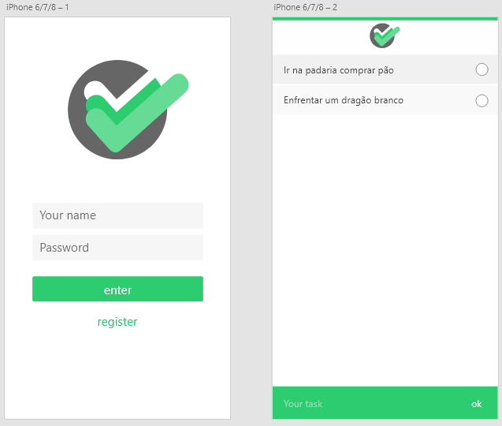
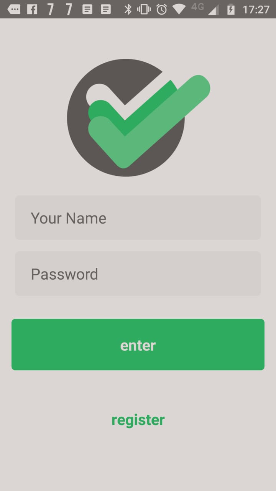
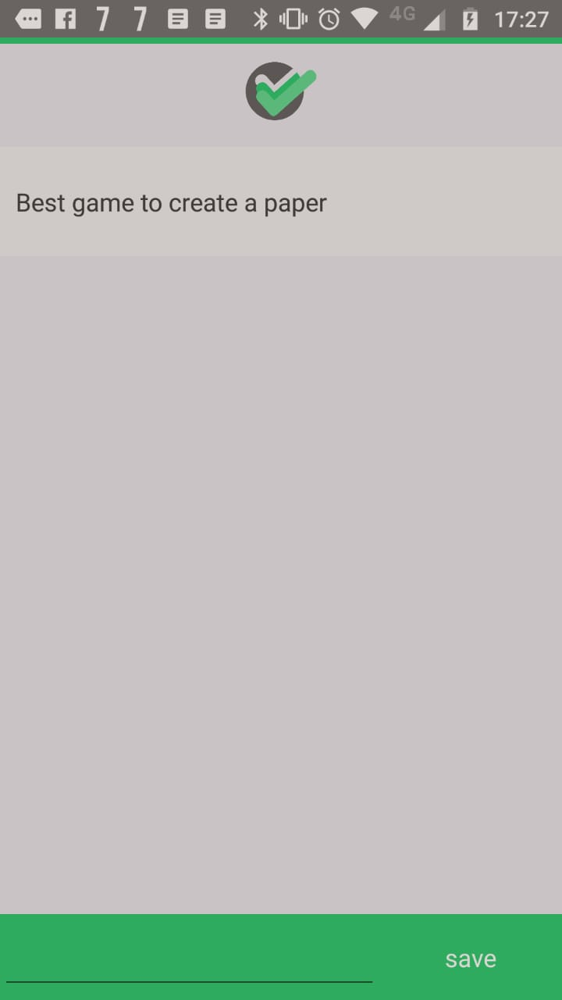

## TODO React Native mais AdonisJS

Aplicativo de treino de AdonisJS e React Native com autenticação JWT.

### Imagens

Protótipo realizado no Adobe XD

Logo

Andamento

> Por algum motivo o print do telefone está escurecendo a imagem. Mas as cores estão como as definidas no protótipo.

